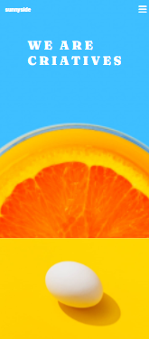
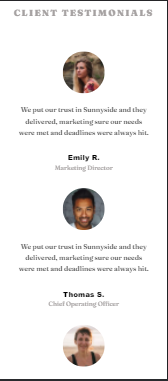
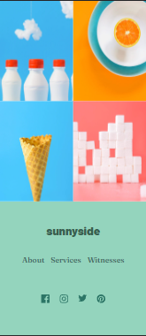
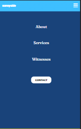
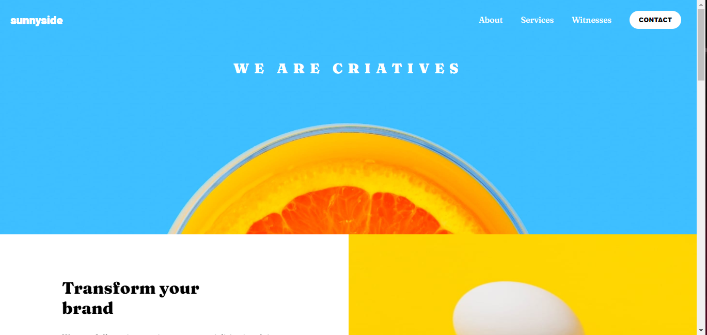
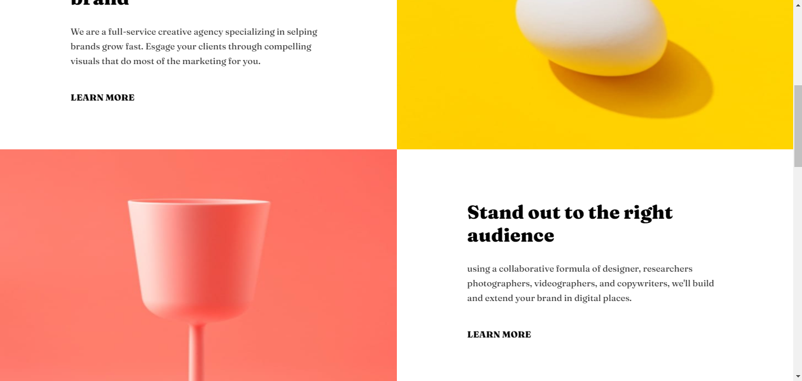
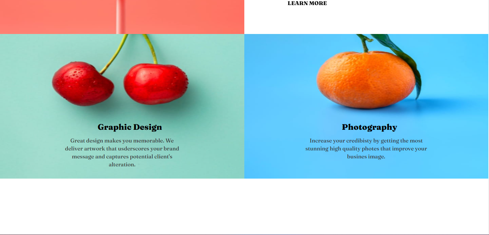
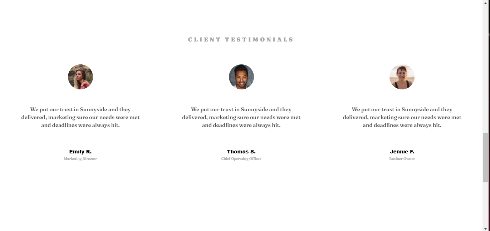
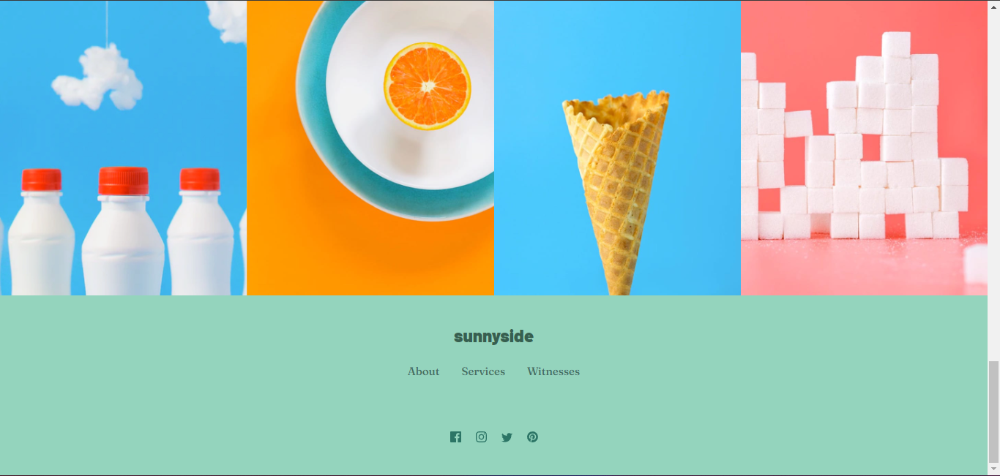

## 🔗 Sobre o Projeto

https://sunnyside-paginaresponsiva.netlify.app/

Landing Page é uma página de vendas de um produto específico.
Este site tem como objetivo capturar leeds para uma empresa de ensino fictícia.

## 📱 Layout para Celular
 

 

## 💻 Layout para Web
 

 

## 🧑‍💻 Tecnologias utilizadas
 

- HTML
- CSS
- JAVASCRIPT
 

## Implantação em produção

- Web de front-end: Netlify
- Flexbox
- Grid template
 

## 🧑‍💻 Autor
 

Ângelo Gustavo Pereira da Silva

Linkedin: www.linkedin.com/in/souangelogustavo

E-mail: angelotj43@gmail.com
